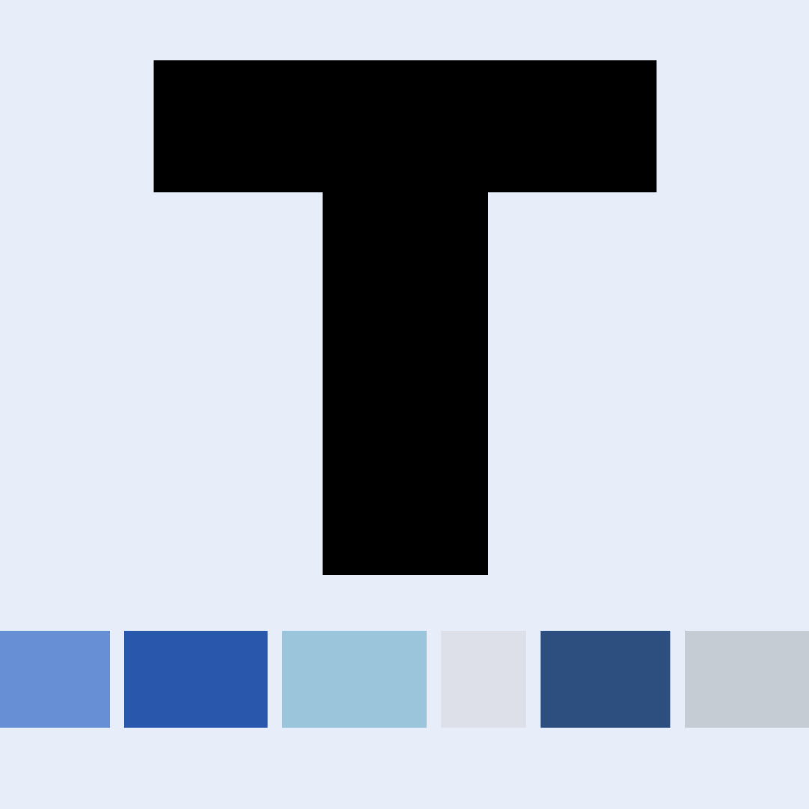

<h1 align="center">
  
  
  <a href="test">DF Tools</a>
</h1>

## Description
An all in one tool for Data Futures, primaraly focusing on Quality Rule Specifications - can be utalised either as a Web Application or Progressive Web Application.

## Features

- Drag and Drop: Implemented in [`DragNDrop.tsx`](src/components/DragNDrop.tsx)
- Custom Renderers: See the [`renderers`](src/components/renderers) directory
- Specification Picker: Implemented in [`SpecificationPicker.tsx`](src/components/SpecificationPicker.tsx)

## Manual Updates
Upon those files been edited, the page will automatically update for others!

Rule Editor:
- Schema: Contained a [JSON Schema](https://json-schema.org/) at [`schema.json`](src/pages/RuleEditor/data/schema.json)
- UI Schema: Contains [UI Elements](https://jsonforms.io/docs/uischema/) at [`uischema.ts`](src/pages/RuleEditor/data/uischema.ts)
- Default Schema: Contains default data when creating a specification at [`defaultdata.json`](src/pages/RuleEditor/data/defaultdata.json) 

## Installation

To install the project, follow these steps:

1. Clone the repository: `git clone <repository-url>`
2. Navigate to the project directory: `cd <project-directory>`
3. Install the dependencies: `npm install`

## Usage

To run the project, use the command: `npm start`

